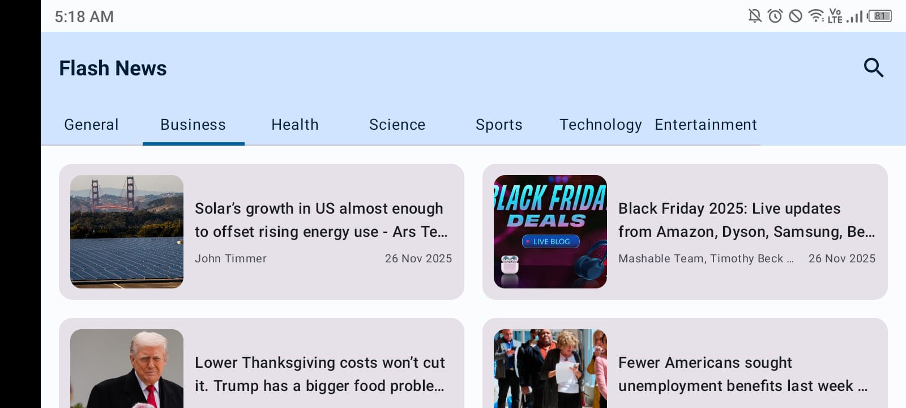
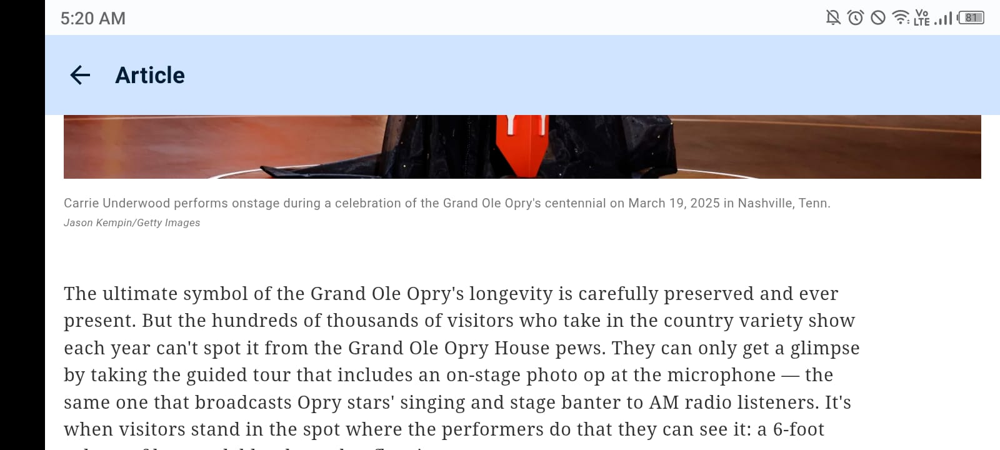
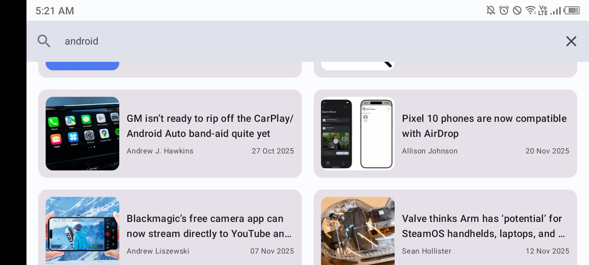
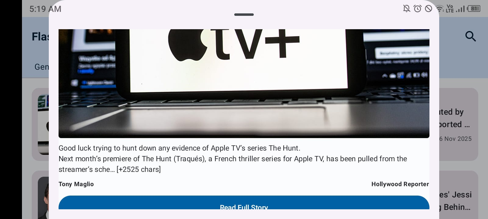
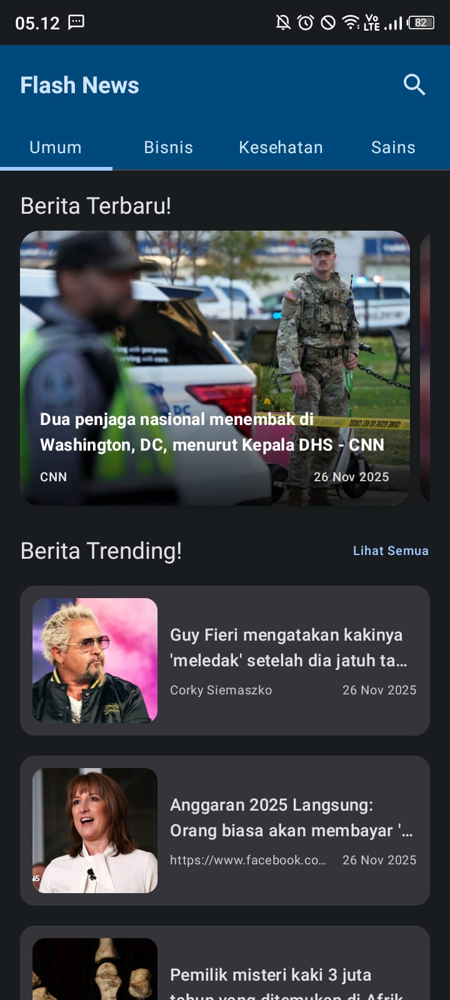
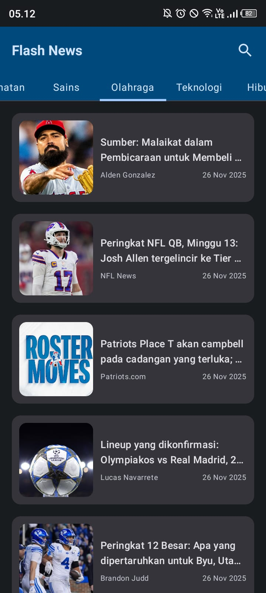
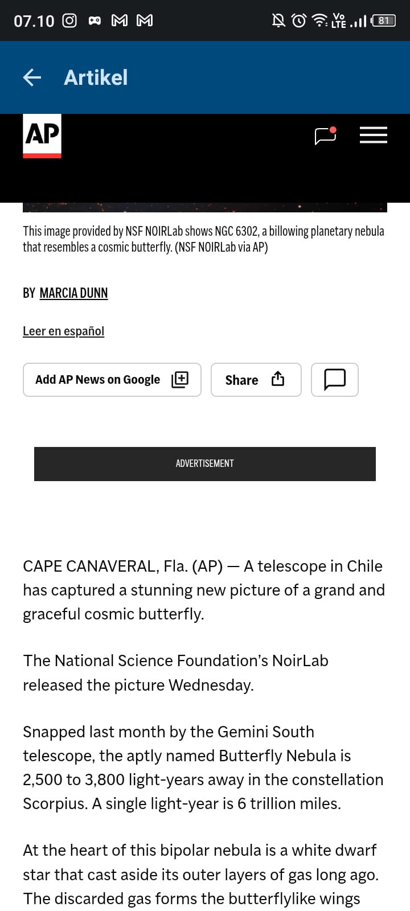
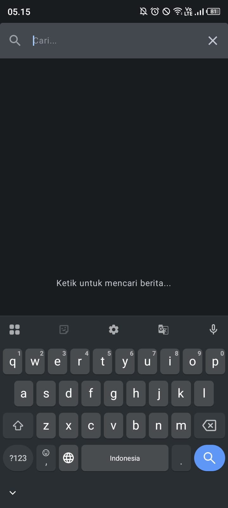
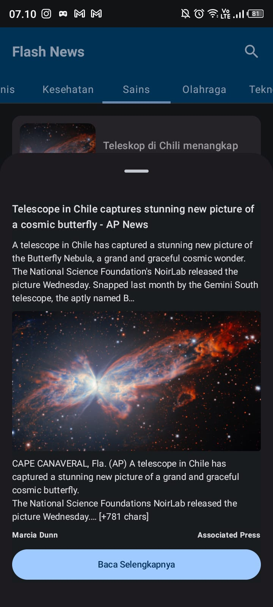

# 🌩️ **FLASHNEWS — Modern Multiplatform News App**

---

  
  
  
  
  
  

---

---

# 📱 **Overview**

**FlashNews** adalah aplikasi berita modern yang dibangun menggunakan **Kotlin + Jetpack Compose**.
Didesain dengan tampilan **clean, elegan, dan responsif**, mendukung:

* 🌗 **Light & Dark Mode**
* 🌍 **Dua Bahasa (Indonesia & English)**
* 🔄 **Portrait + Landscape Layout**
* ⚡ **Live News API**
* 🎨 **UI minimalis dengan smooth interaction**
* 📌 **Struktur kode bersih: MVVM, Hilt, Coroutines, Flow**

FlashNews dirancang untuk pengalaman membaca yang nyaman, cepat, dan intuitif.

---

# 🌞 **Light Mode (Landscape) — English**

> *Optimized for reading, clean layout, modern typography.*

  
  
  
  
  

---

# 🌙 **Dark Mode (Portrait) — Bahasa Indonesia**

> *Tampilan nyaman untuk penggunaan malam hari, elegan dan kontras lembut.*

  
  
  
  
  
  

---

---

# ⚡ **Main Features**

### 📰 1. **Live News API Integration**

* Fetch berita real-time
* Sorting, category, searching
* Optimized error handling

### 🎨 2. **Beautiful UI with Jetpack Compose**

* Declarative UI
* Smooth animations
* Material 3 components

### 🌗 3. **Dual Theme Support**

* Auto-detect system theme
* Custom light/dark color palette

### 🌍 4. **Multilingual Support**

* 🇮🇩 Indonesian
* 🇬🇧 English
* Auto + manual switching

### 🧭 5. **Dual Orientation**

* Potrait → fokus membaca
* Landscape → informasi luas

### ⚙️ 6. **Modern Architecture**

* MVVM + Clean Architecture
* Coroutines + Flow
* Hilt DI
* Coil for image loading

---

# 🛠️ **Tech Stack**

| Layer        | Tools                           |
| ------------ | ------------------------------- |
| Language     | **Kotlin**                      |
| UI           | **Jetpack Compose, Material 3** |
| State        | **ViewModel, StateFlow**        |
| Architecture | **MVVM + Clean Architecture**   |
| API          | **Retrofit, Gson**              |
| Images       | **Coil**                        |
| DI           | **Hilt**                        |

---

<b>Made with ❤️ using Kotlin + Jetpack Compose</b>

